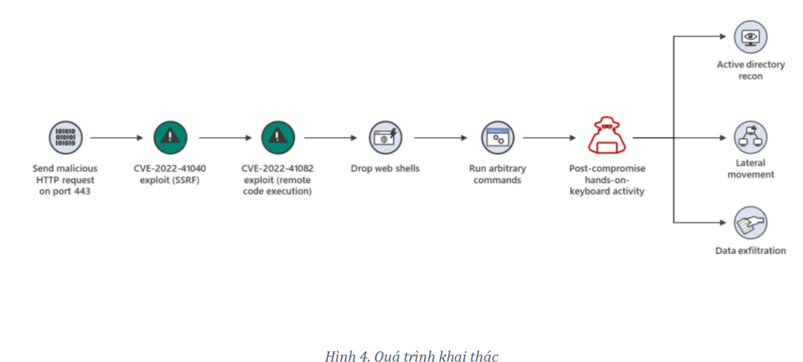
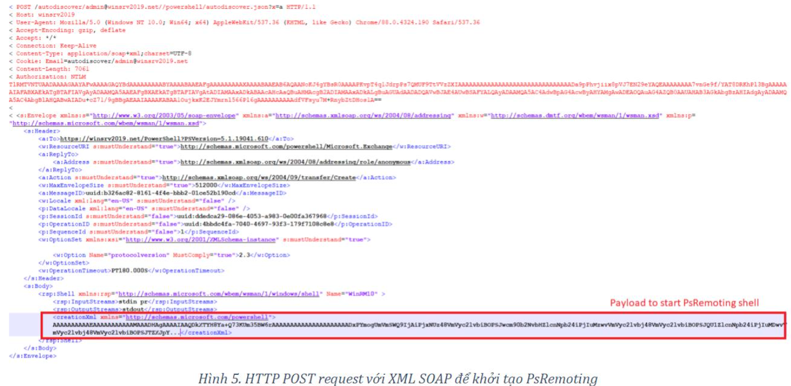
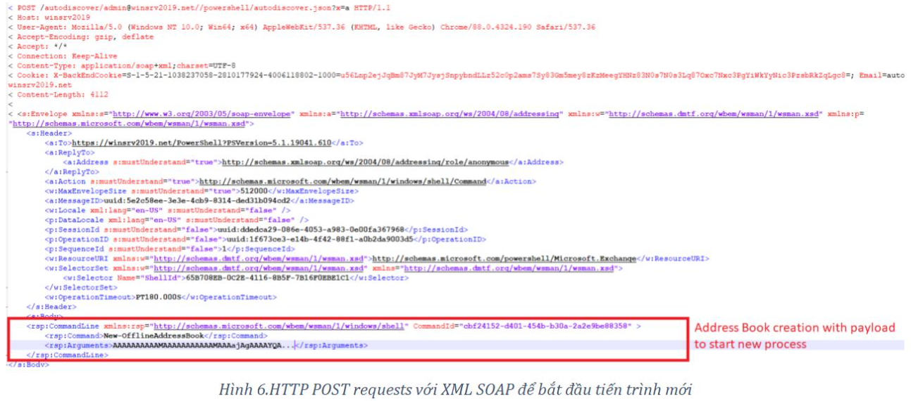
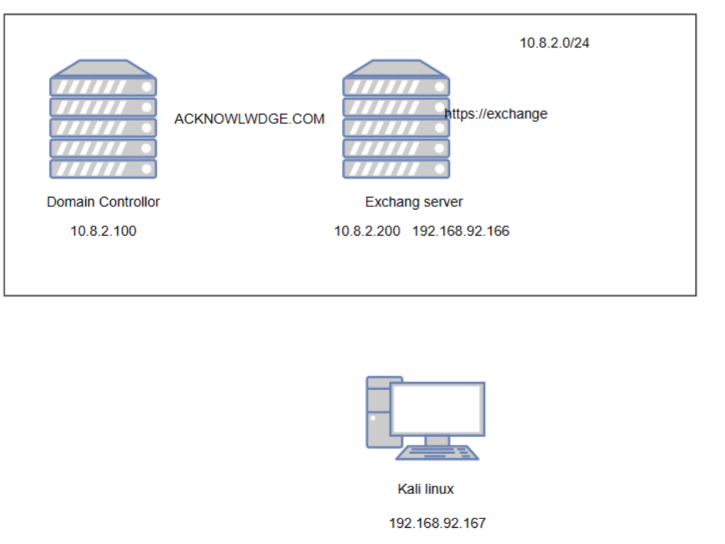
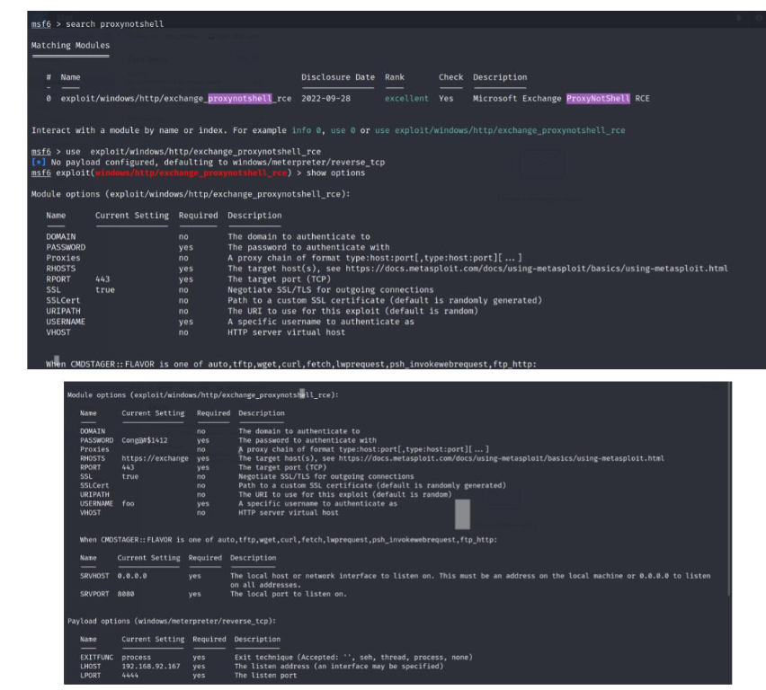

# CyberAttack_CVE_Microsoft_Exchange_Serve

# Tổng quan đề tài 
Thời gian phát hiện 
Vào cuối tháng 9/2022, GTSC đã báo cáo về một cuộc tấn công vào cơ sở hạ tầng quan 
trọng diễn ra vào tháng 8/2022. Trong quá trình điều tra, các chuyên gia phát hiện ra 
rằng hai lỗ hổng zero-day trong Microsoft Exchange Server đã được sử dụng trong cuộc 
tấn công.  
Lỗ hổng đầu tiên, sau này được xác định là CVE-2022-41040, là lỗ hổng giả mạo yêu cầu 
phía máy chủ (SSRF), cho phép kẻ tấn công được xác thực kích hoạt từ xa lỗ hổng tiếp 
theo – CVE-2022-41082.  
Lỗ hổng thứ hai cho phép thực thi mã từ xa (RCE) khi kẻ tấn công có thể truy cập MS 
Exchange PowerShell.  
Như đã lưu ý trong báo cáo GTSC, cả hai lỗ hổng đều bị khai thác cùng nhau để tạo 
backdoor trên máy chủ bị tấn công. 
Link bài báo cáo của GTSC: 
https://gteltsc.vn/blog/warning-new-attack-campaign-utilized-a-new-0day-rce-vulnerability-on-microsoft-exchange-server-12715.html

Tài nguyên bị tấn công

Như đã đề cập ở trên, 2 lỗ hổng này xuất hiện trong Microsoft Exchange Server, các phần mềm bị ảnh hưởng:

- Microsoft Exchange Server 2013 Cumulative Update 23 version

- Microsoft Exchange Server 2016 Cumulative Update 22 version

- Microsoft Exchange Server 2016 Cumulative Update 23 version

- Microsoft Exchange Server 2019 Cumulative Update 09 version

- Microsoft Exchange Server 2019 Cumulative Update 11 version

- Microsoft Exchange Server 2019 Cumulative Update 12 version

Vào ngày 11 tháng 10 năm 2022, Microsoft đã phát hành các bản vá để sửa các lỗ hổng này.

Mức độ nghiêm trọng

Điểm CVSS: 8.8

Khai thác thành công lỗ hổng CVE-2022-41040 có thể cho phép kẻ tấn công đã được xác thực thực thi mã từ xa (CVE-2022-41082) trên máy chủ Exchange tại. Lỗ hổng này được những kẻ tấn công tích cực khai thác. Vì lý do này, ước tính tác động ở mức cao .

# 2. Các công trình liên quan, công cụ sử dụng

## Active Directory
Active Directory hay AD là 1 dịch vụ thư mục đã được Microsoft phát triển nên dành cho những mạng dùng Windows domain.

Ví dụ:

Để hiểu rõ hơn Active Directory là gì hãy cùng điểm qua ví dụ cụ thể sau đây:

- Quản lý người dùng: Quản trị viên CNTT có thể tạo và quản lý tài khoản người dùng của từng nhân viên bằng Active Directory. Khi các tài khoản này được tạo, chúng có thể thêm và quản lý tên tài khoản người dùng, loại tài khoản, mật khẩu và các chi tiết tương tự khác.

- Kiểm soát truy cập và bảo mật: Active Directory cung cấp nhiều tính năng bảo mật mà quản trị viên có thể sử dụng để cải thiện bảo mật tổng thể của hệ thống. Điều này bao gồm triển khai xác thực hai yếu tố, thực thi mật khẩu và ngăn truy cập trái phép vào dữ liệu nhạy cảm.

- Quản lý tài nguyên: Quản trị viên có thể quản lý quyền truy cập vào tài nguyên mạng như máy in, thư mục dùng chung và thiết bị mạng. Họ có thể làm cho các thiết bị này có thể truy cập được đối với những người dùng hoặc nhóm cụ thể, cũng như sửa đổi các quyền để kiểm soát quyền truy cập vào thông tin nhạy cảm.

Tóm lại, Active Directory cung cấp một số chức năng chính bao gồm xác thực, ủy quyền, service thư mục, quản lý Group Policy và chức năng Domain Name System (DNS).

### Các thành phần của Active Directory:

#### Active Directory Objects

Người dùng, cơ sở dữ liệu, nhóm, máy móc, chính sách bảo mật, máy in và máy chủ sẽ được sắp xếp dưới dạng các đối tượng. Mỗi đối tượng sẽ có tập hợp các đặc điểm riêng biệt.

Ví dụ: đối tượng người dùng có các thuộc tính như Logon Name, First Name, Last Name,… và đối tượng máy tính bao gồm các thuộc tính như computer name cùng description.

Ngoài ra, một số đối tượng cụ thể bao gồm nhiều đối tượng khác nhau sẽ được gọi là “container”, ví dụ: domain là container chứa nhiều computer account và user.

#### Active Directory Schema

AD Schema là Database được lưu trữ trong Active Directory. Schema sẽ định nghĩa các đối tượng trong Active Directory.

Schema về cơ bản là một chuỗi các định nghĩa chỉ rõ các loại mục và thông tin được kết nối với các đối tượng được lưu trữ trong Active Directory.

Schema được lưu giống như cách lưu Objects. Schema có hai loại: Schema Class objects và Schema Attribute.

#### Active Directory Components

Active Directory Components được sử dụng và triển khai để phát triển các mô hình phù hợp với mục đích kinh doanh trong mô hình mạng doanh nghiệp hiện đại.

### Cách thức hoạt động:

AD DS dựa trên một số giao thức và tiêu chuẩn đã được thiết lập, bao gồm LDAP (Lightweight Directory Access Protocol), Kerberos và DNS (Domain Name System).

## Microsoft Exchange Server

Microsoft Exchange Server là một máy chủ email ảo cho phép doanh nghiệp thực hiện các thao tác gửi-nhận thư, quản lý Danh bạ và Lịch.

Tất cả các thiết bị di động, máy tính để bàn, máy tính bảng và hệ thống dựa trên web đều có thể truy cập vào nền tảng nhắn tin với Exchange Server của Microsoft.

Sử dụng giao thức truy xuất email độc quyền của Microsoft – MAPI – để kết nối với các ứng dụng email, Exchange Server còn hỗ cho POP3, IMAP đồng thời dùng giao thức SMTP để giao tiếp với các máy chủ thư Internet khác.

Hệ thống máy chủ Exchange được cấp phép phần mềm tại chỗ và phần mềm dưới dạng dịch vụ (SaaS).

### Các thành phần chính của Microsoft Exchange Server:

Bốn thành phần chính của Microsoft Exchange Server gồm:

· Information Store: Kho lưu trữ thông tin cũng như một vị trí để định vị và sắp xếp các email.

· System Attendant: Hệ thống có khả năng tạo và quản lý các địa chỉ email.

· SMTP (Simple Mail Transfer Protocol): Đây là thành phần quan trọng cho phép giao tiếp giữa các máy chủ.

· Active Directory: phụ trách cập nhật thông tin hộp thư mới của System Attendant. Nó cũng quản lý các tài khoản người dùng và danh sách phân phối của riêng mình.

Sau khi đã định cấu hình máy chủ Exchange, bạn phải tạo tài khoản email cho mỗi người dùng. Mỗi tài khoản Email phải được thiết lập cấu hình riêng biệt cùng với phân quyền riêng. Sau khi người dùng đã được tạo, quản trị viên phải cấu hình các tùy chọn lọc. Exchange Server hỗ trợ ngăn chặn và lọc thư rác, vi rút và các email không mong muốn khác. Các tài khoản IP được thiết kế để chặn một đối tượng cụ thể có thể chặn các tin nhắn đến.

Nếu đã biết Microsoft Exchange Server là gì ta cũng nhận thấy tin nhắn gửi đến cũng có thể bị Exchange Server chặn. Hỗ trợ những email được chỉ định mới được chuyển đến, theo các chính sách của tổ chức. Email được gửi đến người nhận thích hợp sau khi được máy chủ Exchange xem xét và phê duyệt

## Metasploit

Metasploit Framework là một môi trường dùng để kiểm tra, tấn công và khai thác lỗi của các service.

Metasploit được xây dựng từ ngôn ngữ hướng đối tượng Perl, với những component được viết bằng C, assembler, và Python. Metasploit có thể chạy trên hầu hết các hệ điều hành: Linux, Windows, MacOS

# Cyber attack

## Lỗ hổng CVE-2022-41040 và CVE-2022-40182 - ProxyNotShell

Bước đầu tiên trong cuộc tấn công này là khai thác CVE-2022-41040 để có quyền truy cập vào điểm cuối API PowerShell.

Dựa vào lỗ hổng khi tính năng lọc dữ liệu đầu vào không đầy đủ trong cơ chế Autodiscover của Exchange. Kẻ tấn công có tổ hợp thông tin đăng nhập và mật khẩu đã biết cho tài khoản đã đăng ký, có thể có quyền truy cập vào điểm cuối đặc quyền của Exchange Server API ( https://% Exchange server domain% / powershell) .

Quyền truy cập này cho phép kẻ tấn công thực thi các lệnh PowerShell trong môi trường Exchange trên máy chủ, chuyển payload thông qua giao thức XML SOAP.

Ở bước tiếp theo, kẻ tấn công phải có quyền truy cập vào Web-Based Enterprise Management (WBEM) thông qua Giao thức WSMAN .

Kẻ tấn công khởi tạo shell trên hệ thống để thực thi tập lệnh PowerShell tiếp theo thông qua Windows Remote Management (PsRemoting)

Sau đó, kẻ tấn công khai thác lỗ hổng thứ hai – CVE-2022-41082 . Bằng cách sử dụng PowerShell Remote, kẻ tấn công sẽ gửi yêu cầu tạo sổ địa chỉ, truyền dữ liệu được mã hóa và tuần tự hóa với một tải trọng đặc biệt làm tham số. Trong PoC được xuất bản, dữ liệu được mã hóa này chứa một tiện ích có tên System.UnitySerializationHolder tạo ra một đối tượng của lớp System.Windows.Markup.XamlReader . Lớp này xử lý dữ liệu XAML từ một payload, tạo ra một đối tượng mới của lớp System.Diagnostics và chứa lệnh gọi phương thức để mở một quy trình mới trên hệ thống đích.

### Hậu khai thác ProxyNotShell

- Reconnaissance (users, groups, domains)

- Remote process injection

- Reverse shell

## Mô hình mạng tấn công:

### Chi tiết:

Trong mô hình mạng Active directory trên có tên miền là Acknowledge.com. Gồm 2 máy 1 là Domain Controllor có IP là 10.8.2.100 và 1 máy là Microsoft Exchange Server có IP là 10.8.2.200. Máy Kali Linux là máy có tài khoản đăng nhập chứng thực sẽ được dùng để khai thác hai lỗ hổng CVE-2022-41040 và CVE-2022-40182. Sau đó RCE(Remote code execution) máy Microsoft email exchange server có chứa lỗ hổng. Sau đó kiểm soát được máy Microsoft Exchaneg server. Từ đó leo thang đặc quyền rồi lây nhiễm quyền kiểm soát sang các máy khác trong mạng (Lateral movement) bằng mã độc. 

### Các bước thực hiện:

Sử dụng công cụ metasploit để tấn công.

* Bước 1: Chọn payload và thêm các tham số cần thiết bao gồm: USERNAME, PASSWORD, tên miền máy exchange.

- Payload mặc định là reverse_tcp.

* Bước 2: Thực hiện tấn công và chiếm quyền shell.

